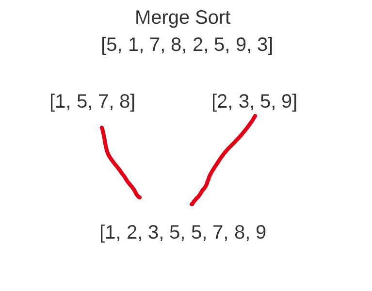

# Merge sort

A merge sort algorithm breaks down a problem into multiple small problems recursively.
Until the problems can be solved in a single opperation, than combines the solutions together
to reach a solution to the larger whole problem. 

Merge sort has a O(n * log(n)) running time. 

### Steps
    1. Split the list into halves
    2. Continue recursively splitting the list, until we have sub lists, of just 2 values.
    3. Perform a simple sort on the smaller lists.
    4. Combine sublists into single sorted list.


### Example list. [5, 1, 7, 8, 2, 5, 9, 3]

Split the first list in half.


Recursively call the algorithm to continue splitting the sublists into smaller lists.


At this point our sublists, can only be into single values


as we split the sublists into single values, but we immediately compare the values
and recombine them in sorted order.


We now have begun re-combining the lists, As we do this we compare the value of our sections
and re-arrange as needed. to maintain a sorted list. 



Our final code for the algorithm looks like this. 

```python
def merge_sort(list):
    if len(list) > 1:
        left_split = list[:len(list) // 2]
        right_split = list[len(list) // 2:]

        merge_sort(left_split)
        merge_sort(right_split)

        i = 0  # left list index
        j = 0  # right list index
        k = 0  # merged list index
        while i < len(left_split) and j < len(right_split):
            if left_split[i] < right_split[j]:
                list[k] = left_split[i]
                i += 1
            else:
                list[k] = right_split[j]
                j += 1
            k += 1

        while i < len(left_split):
            list[k] = left_split[i]
            i += 1
            k += 1

        while j < len(right_split):
            list[k] = right_split[j]
            j += 1
            k += 1

    return list
```